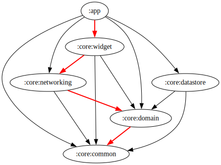

  

  <ul style="list-style: none; padding-left: 0;">
    

      

        <h1>WiFi Widget</h1>
      

    

  </ul>

  
  
  
  

   

  
  

   

  
  
  

------

<b>Android app providing a fully configurable widget for the monitoring of your WiFi connection details.</b>

------

|  |  |  |
|----------------------------------------------------------------------------------------------------------------------|----------------------------------------------------------------------------------------------------------------------|----------------------------------------------------------------------------------------------------------------------|
|  |  |  |

  <ul style="list-style: none; padding-left: 0;">
    

      

        <h1>Where to get it</h1>
      

    

  </ul>

  <ul style="list-style: none; padding-left: 0;">
    

      

        <h1>Features</h1>
      

    

  </ul>

### In-App

- Neat Material 3 Design
- Configurable theme:
    - Light / dark
    - Dynamic / static colors
    - AMOLED black
- Adaptive layouts for landscape & portrait mode
- Live WiFi Status display with property copy-to-clipboard functionality on click

### Widget
- Property copy-to-clipboard functionality on click
- **Configuration options:**
    - Appearance:
        - Size: from 2x1 to fullscreen
        - Light/dark theme with static/dynamic, or entirely custom colors
        - Background opacity
        - Font size
        - Property value alignment (left | right)
    - Displayed properties:
        - **Basic Info**: SSID, BSSID, Frequency, Channel, Link Speed, RSSI, Signal Strength, Standard, WiFi Generation, Security Protocol  
        - **IP Addresses**:
          - Types: Loopback, Site Local, Link Local, Unique Local, Multicast, Global Unicast, Public (via [api.ipify.org](https://api.ipify.org))
          - Options: IPv4, IPv6, or both; show prefix lengths (IPv4/IPv6) and subnet masks (IPv4)
        - **Network Details**: Gateway, DNS, DHCP, NAT64 Prefix  
        - **Location Info** (via [ip-api.com](https://ip-api.com/)):
          - Region: Zip Code, District, City, Region, Country, Continent  
        - **Other**: GPS Location, ASN, ISP
    - Property appearance order
    - Bottom bar elements:
        - Last refresh date time
        - Buttons:
            - Refresh data
            - Open WiFi settings
            - Open widget settings
    - Automatic data refreshing:
        - Interval: between 15 min and 24h 
        - Whether to refresh on low battery

  <ul style="list-style: none; padding-left: 0;">
    

      

        <h1>Tech Stack</h1>
      

    

  </ul>

- Kotlin only
- Jetpack Compose for in-app UI, xml & RemoteViews for widget UI
- [Jetpack Navigation 3](https://developer.android.com/guide/navigation/navigation-3?hl=de)
- Coroutines & flows
- [Dagger-Hilt](https://dagger.dev/hilt/) for dependency injection
- [OkHttp](https://square.github.io/okhttp/) for network requests, [kotlinx serialization](https://github.com/Kotlin/kotlinx.serialization) for JSON parsing
- Proto & Preferences data storage
- JUnit 4, [mockito](https://github.com/mockito/mockito), [robolectric](https://robolectric.org/) & [turbine](https://github.com/cashapp/turbine) for unit testing
- JUnit 4 Compose android (instrumented) testing
- Androidx Macro benchmarking & baseline profile generation with app-specific usage journey, implemented with [UI Automator](https://developer.android.com/training/testing/other-components/ui-automator)

  <ul style="list-style: none; padding-left: 0;">
    

      

        <h1>Architecture</h1>
      

    

  </ul>

- **Multi-modular build**
- **Gradle Convention plugins** for gradle code reuse whilst keeping modules independent from one another
- **Clean architecture** (or however you wanna call it), with the UI and data layers depending on the domain layer, which exposes the data model and repository interfaces:

    

  <ul style="list-style: none; padding-left: 0;">
    

      

        <h1>Credits</h1>
      

    

  </ul>

Logo foreground by <a href="https://freeicons.io/profile/75801">Hilmy Abiyyu Asad</a> taken
from <a href="https://freeicons.io/computer-devices-3/router-wifi-internet-hotspot-icon-487667#">here</a>,
where it is licensed
under <a href="https://creativecommons.org/licenses/by/3.0/">Creative Commons(Attribution 3.0 unported)</a>.

  <ul style="list-style: none; padding-left: 0;">
    

      

        <h1>Donations</h1>
      

    

  </ul>

  <ul style="list-style: none; padding-left: 0;">
    

      

        <h1>License</h1>
      

    

  </ul>

<a href="https://github.com/w2sv/WiFi-Widget/blob/main/LICENSE">GPL-3.0 License</a> © <a href="https://github.com/w2sv">w2sv</a> [2022 - Present]

